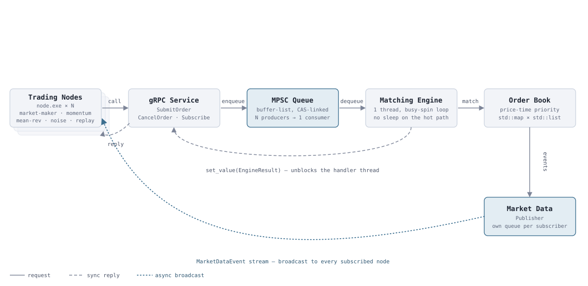
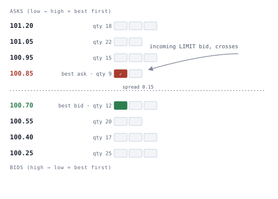

# Market Sandbox

Market_Sandbox is a trading exchange engine written from scratch in C++17. At its core sits a lock-free multi-producer single-consumer queue feeding a price-time-priority matching engine, wrapped in gRPC for order entry and streaming market data. On top of that, a handful of algorithmic bots trade against each other so the book actually has something to match.

I built this to challenge myself to construct the actual heart of a trading venue, namely the order book and the matching engine. Secondly, I wanted to experiment with a performance of my implementation and applied improvements. It's a portfolio project, not a production system yet.
An interactive walkthrough with diagrams is provided in [`docs/showcase.html`](docs/showcase.html).


## How an order is handled

A gRPC handler thread doesn't touch the order book directly. It hands the order to a MPSC queue and blocks on a `std::promise`. Once the order is evaluated, the response comes back through that promise instead of reading anything back off the queue. The live market data such as trade prints and top-of-book updates are communicated by a completely different path. They're pushed to a per-subscriber queue and streamed out asynchronously, unrelated to whichever request triggered them.

<p align="center">
  
</p>


## The order book

Bids and asks live in C++ standard library implementation of ordered map. Each price level is a linked list  because specifically of two reasons. The first is that it preserves the order of addition. Secondly, the iterators used for cancelling orders stay after data manipulation (unlike `std::deque`/`std::vector` which  would invalidate them). 


<p align="center">
  
</p>

Matching procedure is conceptually a fairly simple price-time priority routine. However, since we are dealing with market and limit order types it requires some more complexity. 

An incoming order walks the opposite side book from the best price outward, filling resting orders oldest-first within each level it crosses. A `LIMIT` that doesn't fully cross rests at its price in the order book. A `MARKET` order that can't fully fill is rejected: whatever quantity *did* execute is still reported, but nothing is left resting.

## The MPSC queue

Order submission is many gRPC handler threads producing into exactly one matching-engine thread which is a genuine multi-producer/single-consumer (MPSC) problem. 
Our MPSC queue implementation is built around [*Jiffy*](https://arxiv.org/abs/2010.14189) (Adas & Friedman, Technion, DISC 2020).

The reason why I decided to go with this implementation was the fact that the paper's own numbers were the deciding factor: roughly 10x faster than Michael-Scott, up to 50% faster than its closest wait-free competitor, and about 90% less memory, since each queued item costs almost nothing beyond a 2-bit status flag.

Under the hood, producers claim slots with a plain atomic increment, arrays are chained together and pre-allocated ahead of need so producers essentially never wait on each other, and the one genuinely hard part was producers finishing out of order. They are handled by having the single consumer scan ahead for whichever slot actually landed.


## The bots

`node.exe --strategy=<name>` is the client program. Every strategy below is a flag. They share one gRPC client and one `Subscribe` listener defined in `nodes/common/`.

| Strategy | What it does |
|---|---|
| `market-maker` | Rests a bid and an ask around the current mid, re-quoting when price drifts past a threshold. The default source of resting liquidity. |
| `momentum` | Tracks a rolling trade-price window. Fires a market order in the direction of the recent trend once it clears a threshold return. |
| `mean-reversion` | Same rolling window, opposite bet: sells when price has run up too far above its recent average, buys when it's dropped too far below, betting it snaps back. |
| `noise` | Random side/size/price jitter on a probability gate each tick, with a standing chance to cancel its own resting orders. Pure activity generator. |
| `replay` | Loads a bundled CSV of `(offset_ms, price)` checkpoints and nudges the market toward each one on an accelerated clock |

`nodes/launch_nodes.ps1` starts a specific mix: 2 market makers, 2 momentum, 1 mean-reversion, 4 noise traders, 1 replay against `localhost:50051` and logs each to `nodes/logs/<id>.log`.

## Performance

These came out of two small benchmark binaries in this repo (`mpscqueue_benchmark`, `exchange_benchmark`), run on one dev machine.

| Benchmark | Result |
|---|---|
| MPSC queue, single thread | 70.2M ops/sec (4,000,000 enqueue+dequeue ops) |
| MPSC queue, 4 producers → 1 consumer | 22.2M ops/sec (2,000,000 ops) |
| `SubmitOrder`, sequential (1 client, 1 call at a time) | 6,162 req/sec |
| `SubmitOrder`, concurrent (8 client threads × 1,500 calls) | 16,410 req/sec |

Sequential `SubmitOrder` latency, full gRPC round trip through the queue and matching engine (n=3,000):

| Percentile | Latency |
|---|---|
| min | 0.133 ms |
| p50 | 0.152 ms |
| p90 | 0.188 ms |
| p99 | 0.330 ms |
| max | 1.998 ms |

**Method.** Windows 11, MSYS2 UCRT64 g++ 15.2, exchange and benchmark client both on `localhost`, insecure gRPC channel, one order per RPC. Sequential = one client issuing blocking calls one at a time after a 200-call warmup. Concurrent = 8 client threads racing independently, wall-clock across the whole run. MPSC numbers are the queue in isolation: no gRPC, no matching logic involved. The p99-to-max gap (0.33ms → 2.0ms) is one real scheduler or allocator hiccup in a few thousand calls, not a rounding artifact; shown rather than trimmed.


## What's actually in here

```
proto/                  order.proto, trading.proto, marketdata.proto
exchange/OrderProcessor/
  entity/                domain types (Order, enums mirroring the proto ones)
  dto/                   thin proto <-> entity mappers
  repo/                  the MPSC queue (+ its smoke test and benchmark)
  engine/                order book, matching engine, market data publisher
  service/                the gRPC server (exchangeService.exe)
nodes/
  common/                the gRPC client + strategy interface node.exe is built from
  strategies/            the 5 bots
  bench/                 a small gRPC latency/throughput benchmark
  launch_nodes.ps1        starts a mix of 10 bots against one exchange
docs/
  showcase.html          the page linked above
  diagrams/               the two SVGs embedded below
```


## Building

Requires MSYS2 UCRT64 (g++ 15+), CMake, and gRPC/Protobuf installed into that environment.

```powershell
cmake -S . -B build
cmake --build build
```

This produces `build/exchangeService.exe` and `build/node.exe`. The gRPC/Protobuf DLLs live in MSYS2's environment, so put them on `PATH` before running anything built here:

```powershell
$env:PATH = "C:\msys64\ucrt64\bin;" + $env:PATH
```

Two extra targets are gated behind CMake options because they're development tools, not part of the product:

```powershell
cmake -S . -B build -DBUILD_MPSCQUEUE_SMOKETEST=ON -DBUILD_BENCHMARKS=ON
cmake --build build
./build/mpscqueue_smoketest.exe   # correctness: single-thread + 4-producer round trips
./build/mpscqueue_benchmark.exe   # throughput: queue in isolation
./build/exchange_benchmark.exe    # throughput/latency: full gRPC round trip (needs exchangeService.exe running)
```

## Running

```powershell
# terminal 1
./build/exchangeService.exe

# terminal 2
./build/node.exe --strategy=market-maker --node-id=mm-1 --server=localhost:50051

# or, for the full demo
./nodes/launch_nodes.ps1
```


